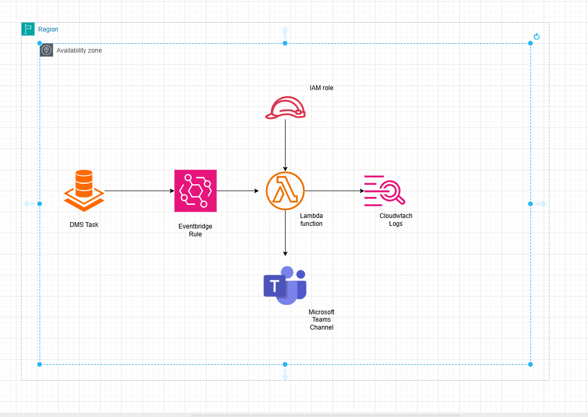

# DMS Tasks Status Alerts

This project provides an automated system for alerting on the various DMS tasks status such as "created", "deleted" "Failure".

---

## Table of Contents

1. [Overview](#overview)
2. [Architecture Blueprint](#Architecture-Blueprint)
3. [Features](#features)
4. [Prerequisites](#prerequisites)
5. [Project Structure](#project-structure)
6. [Deployment Guide](#deployment-guide)
   - [1. Clone Repository](#1-clone-repository)
   - [2. Initialize and Plan](#3-initialize-and-plan)
   - [3. Apply Changes](#4-apply-changes)
   - [4. Verify Deployment](#5-verify-deployment)
7. [Terraform Resources](#terraform-resources)
8. [Logging and Storage](#logging-and-storage)
9. [Clean Up to Save Cost](#Clean-Up-to-Save-Cost)
10. [Troubleshooting](#troubleshooting)
11. [Contributing](#contributing)

---

## Overview

Another project is upon us hehe! Remember, the saying necessity is the mother of invention??? Well this project may not necessarily be an invention but when our vital DMS task failed overnight and we woke up to complaints, there was a necessity for this solution to be born.


**Let me elaborate more on the use case:**

We have a couple of DMS tasks replicating data from databases to other endpoints. In our scenario, during the night, DMS Task A failed to replicate data to the endpoint the financial team uses to for their transaction calculations and was not caught by the monitoring team since they do not have direct access to the DMS console, hence there was a need for proactive monitoring for our DMS task statuses.

This solution:

- Listens for DMS Tasks Statuses via EventBridge.
- Triggers a Lambda function to process and record event details.
- Stores raw event payloads in Lambda CloudWatch Logs 
- Extracts required data and sends alerts to a Microsoft Teams channel.
- Is deployed entirely through Terraform for repeatable infrastructure management.


## Architecture Blueprint

```plaintext
┌──────────────┐    Tasks Status    ┌────────────────┐
│  Amazon DMS Tasks  │ ─────────────────> │ Amazon Event   │
│              │                    │ Bridge Rule    │
└──────────────┘                    └────────┬───────┘
                                                │
                                                │ Event matches `DMS Tasks Event`
                                                ▼
                                          ┌───────────────┐
                                          │ AWS Lambda    │
                                          │ (Processor)   │
                                          └────────┬──────┘
                                                   │
                                                   │ Processes event and writes to:
                                                   │ - CloudWatch Logs (optional but useful for troubleshooting)
                                                   ▼
                                        ┌────────────────────┐
                                        │ Alerting           │
                                        │ (Microsoft Teams)    │
                                        └────────────────────┘
```

## Architecture Diagram



## Features

- **Event Subscription**: Listens to DMS Tasks snapshot events (`creation`, `deletion`).
- **Serverless Processing**: Uses a lightweight Lambda for event handling.
- **Configurable Destinations**: Supports CloudWatch Logs.
- **Infrastructure as Code**: Entire setup managed via Terraform.
- **Notification**: Notifies monitoring team via Teams Channel.

## Prerequisites

- [AWS Account](https://docs.aws.amazon.com/accounts/latest/reference/manage-acct-creating.html) 
- [Terraform](https://www.terraform.io/downloads.html) 
- [Microsoft-Teams-Webhook](https://sankalpit.com/plugins/how-to-get-channel-webhook-url) 

## Project Structure

```
DMS-Tasks-Status-Alerts/
├── .terraform/                   # Terraform working directory
├── layer/                        # Lambda layers or additional code dependencies
├── .gitignore                    # Git ignore rules
├── .terraform.lock.hcl           # Terraform dependency lock file
├── architecture-diagram.png      # Project Architecture
├── data.tf                       # Data sources configuration
├── event-bridge.tf               # EventBridge rule definitions
├── iam_role.tf                   # IAM roles and policies
├── lambda_function.py            # Lambda handler code
├── main.tf                       # Terraform root configuration
├── provider.tf                   # Terraform provider setup
├── README.md                     # Project documentation
└── variables.tf                  # Input variable definitions
```

## Deployment Guide

### 1. Clone Repository

```bash
git https://github.com/tayelma/DMS_Tasks_Status_Alerts.git
cd DMS-Tasks-Status-Alerts

NB: I would not advise you clone this repository if you are new in the business and your goal is to learn. You assimilate knowledge better by getting your hands dirty, cloning the repository doesn't get your hands so dirty since you are not building from scratch.
```

### 2. Initialize and Plan

```bash
terraform init
terraform plan -var-file=terraform.tfvars
```

### 3. Apply Changes

```bash
terraform apply -var-file=terraform.tfvars
```

### 4. Verify Deployment

1. In the AWS Console, navigate to EventBridge -> Rules. Confirm your rule is enabled.
2. Go to Lambda -> Functions. Verify your function is deployed with the correct handler.
3. Check the CloudWatch Logs attached to your lambda function under the **"Monitor"** tab for the recorded event. [https://docs.aws.amazon.com/lambda/latest/dg/monitoring-cloudwatchlogs-view.html]
4. You can test your lambda function by using the json payload of the DMS event recorded in the cloudwatch logs and using it as test message under the lambda **"Test"** tab.


## Terraform Resources

- **data**: The "aws_caller_identity" block retrieves the aws profile to be used for the project and the "archive_file" block zips the lambda function in the current directory. 

- **event-bridge**: Creates a DMS EventBridge rule to listen to DMS tasks statuses and maps it to your lambda function as the target.

- **iam**: Configures the necessary permissions that allows Lambda to describe DMS Replication Tasks snapshots, execute the eventb and write logs.

- **lambda_function**: The python code extracts the required data for the DMS alerts and pushes it to the Teams Channel when triggered by the event rule.

- **main**: This terraform file creates the lambda function and the cloudwatch log group.

- **provider**: The provider file allows you to set configurations for the aws profile and region, where your terraform state will be stored (in this case, an s3 bucket) and optionally the terraform and aws version you want to use.

## Logging

- **CloudWatch Logs**: Lambda logging of DMS Tasks events frome eventbridge for debugging. 


## Clean Up to Save Cost

Remove all infrastructure:

```bash
terraform destroy -var-file=terraform.tfvars
```

## Troubleshooting

| Issue                                   | Solution                                                 |
| --------------------------------------- | -------------------------------------------------------- |
| Lambda permission denied                | Ensure EventBridge rule has permission to invoke Lambda. |
| No events in S3                         | Check CloudWatch Logs for errors in Lambda execution.    |
| Terraform plan shows unexpected changes | Verify variable values and versions.              |


## Contributing

1. Fork the repository
2. Create a feature branch (`git checkout -b feature/xyz`)
3. Commit your changes (`git commit -m 'Add new feature'`)
4. Push to your branch (`git push origin feature/xyz`)
5. Open a Pull Request


